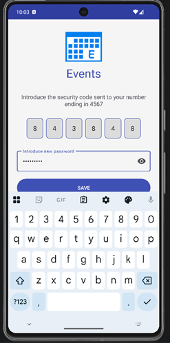

## 🎥 Code Review Video

<iframe src="https://drive.google.com/file/d/10koSWxyQLtFEhYQfeObbxoFAz5xMFhHr/preview" 
width="800" height="500" allow="autoplay">
</iframe>

---

## 🛠️ Software Design and Engineering Enhancements

For the Software Design and Engineering enhancement, I strengthened the application's security, usability, and architecture by implementing several industry-standard improvements. I introduced login attempt limiting with cooldown periods to mitigate brute-force attacks, along with SMS-based multi-factor authentication (MFA) for secure login and password recovery workflows. I redesigned the authentication lifecycle using a state-machine approach and implemented stateless session management through persistent storage, enabling seamless user experiences while maintaining security. From an architectural perspective, I applied MVVM principles, separation of concerns, and reusable UI components to manage complex authentication flows and interactions efficiently. Additionally, I enhanced the user experience by grouping past events into a collapsible section to reduce cognitive load and by integrating a calendar view to provide an alternative, intuitive way to navigate events. These improvements reflect best practices in secure software design, user-centered development, and scalable mobile architecture.

### 📸 Application Enhancements Preview

  
  
  

