# Welcome to my Computer Science Capstone ePortfolio

Welcome! This repository serves as a comprehensive showcase of my technical journey at Southern New Hampshire University. Here, you will find a curated collection of projects and enhancements that demonstrate my evolution from foundational programming to developing secure, scalable, and data-driven software architectures. Thank you for visiting, and I invite you to explore my work as I prepare to transition into the next phase of my career in data engineering and intelligent systems.

---

## 📑 Table of Contents
1. [Professional Self-Assessment](#-professional-self-assessment)
2. [Project Overview](#-project-overview)
3. [Code Review](#-code-review)
4. [Project Enhancements](#-project-enhancements)
   - [Software Design and Engineering](#software-design-and-engineering)
   - [Data Structures and Algorithms](#data-structures-and-algorithms)
   - [Databases](#databases)
5. [Conclusion and Next Steps](#-conclusion-and-next-steps)

---

## 👨‍💻 Professional Self-Assessment

### Introduction
I am Raymond Bautista, a Dominican engineer with a strong passion for science, technology, and data-driven problem-solving. Holding an Associate Degree in Mechatronics Technology, I bring over three years of professional experience spanning Mechatronics, Industrial Engineering, and Data Analysis. My career has been defined by a hands-on approach to complex engineering challenges, from programming embedded systems in C and designing PCBAs, to analyzing project feasibility, cost models, and manufacturing architectures. By combining automation with robust data analysis, I have successfully implemented tools that reduce manufacturing downtime and streamline engineering evaluations for new PCBA products. 

My technical stack includes **Python, SQL, R, C/C++, C#, and Java**, complemented by data visualization and management tools like **Power BI, Tableau, and Google BigQuery**. Beyond the code, I pride myself on my ability to collaborate within cross-functional teams, adapt to rapidly changing requirements, and translate complex technical concepts for non-technical stakeholders. 

### Computer Science Program Professional Development
I enrolled in the Computer Science program at Southern New Hampshire University to deepen my expertise in computer systems and software architecture. I have strengthened my ability to design, develop, and evaluate solutions across mobile development, full-stack applications, and scalable data systems. My coursework rigorously reinforced the importance of algorithmic efficiency, modular design, and secure, cloud-based database architectures.

Throughout my studies, I have leveraged both software engineering and applied statistics to build practical solutions. For example, in **MAT-243 (Applied Statistics)**, I utilized Python libraries to build multiple regression models, interpreting complex datasets to guide management-level decisions. In **CS-340 (Client/Server Development)**, I engineered an interactive data dashboard for an animal rescue shelter using Python (Plotly Dash) and MongoDB. Furthermore, in **CS-465 (Full Stack Development)**, I developed a secure Single Page Application for a travel agency utilizing the complete MEAN stack (MongoDB, Express, Angular, Node.js).

  <figure>
    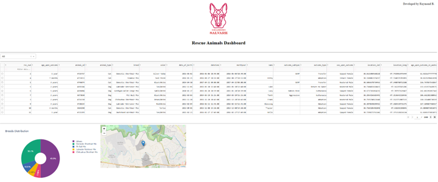
    <figcaption><em>Figure 1 – CS-340 Client Server Development Animal Rescue Shelter Dashboard</em></figcaption>
  </figure>

 

  <figure>
    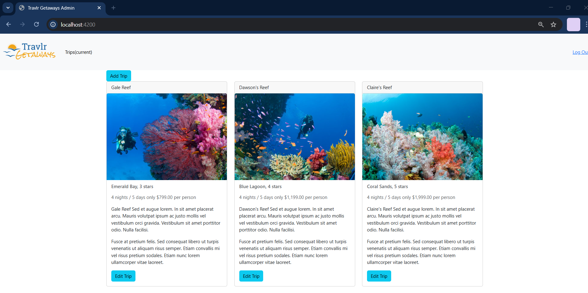
    <figcaption><em>Figure 2 – CS-465 Full Stack Development Travlr Getaways MEAN SPA</em></figcaption>
  </figure>

 

  <figure>
    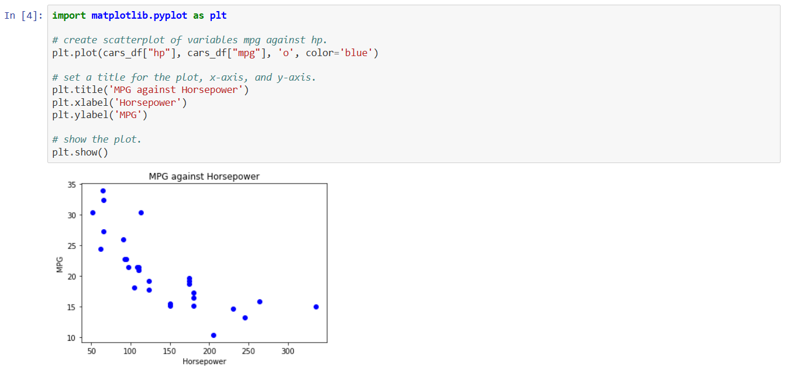
    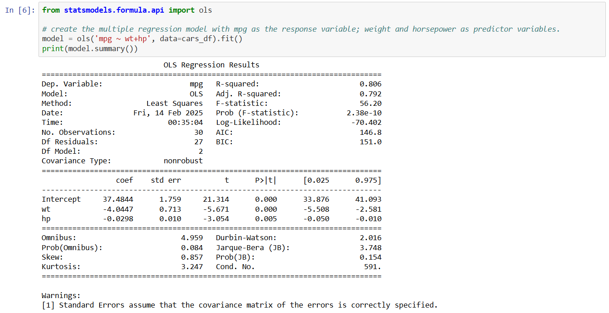
    <figcaption><em>Figure 3 – MAT-243 Applied Statistics Fuel Consumption Multiple Regression Model Analysis</em></figcaption>
  </figure>

### Portfolio Introduction
This portfolio presents a comprehensive collection of enhancements for a capstone project that encapsulates my growth. It highlights my proficiency in software design, data structures, algorithms, and databases, while emphasizing critical industry competencies like security, scalability, and performance optimization. Each artifact reflects my commitment to building robust, efficient, and innovative solutions, demonstrating my readiness to contribute meaningfully to multidisciplinary technology teams.

---

## 📱 Project Overview

This capstone focuses on the complete architectural overhaul of the **Events Android Application**, originally developed in CS-360: Mobile Architecture and Programming. The initial iteration was a user-centered mobile app built with Android Studio, Java, and a local SQLite database. It functioned as a personal scheduling hub, presenting events chronologically to reduce cognitive load and help users manage multi-day commitments. 

While the original application succeeded in its UI/UX goals, it was strictly offline, locked to a single device, and lacked modern security protocols. To align the project with current industry standards, I identified and executed major enhancements across three categories: implementing MFA and secure architectures, applying advanced data structures for search and sorting, and migrating the application to a synchronized, hybrid-cloud database environment. 

  <figure>
    
    <figcaption><em>Figure 4 – Events Android Application Logo</em></figcaption>
  </figure>

---

## 🔍 Code Review

This section presents a comprehensive Code Review of the original "Events" Android application. While typical reviews are limited to written pull requests, this video analysis provides a deep dive into the application’s core logic, functionality, and architectural integrity from both a developer and end-user perspective.

The review is divided into three segments:
1. **Project Overview:** A demonstration of current features and UI/UX within the Android Studio IDE.
2. **Code Walkthrough:** A deep dive into the software architecture, design patterns, and engineering decisions.
3. **Compliance Audit:** A final evaluation against industry-standard checklists for documentation, structure, and security.

*Click the image below to watch the full video on Google Drive:*

  

---

## 🚀 Project Enhancements

### Software Design and Engineering
For this enhancement, I strengthened the application's security, usability, and architecture by implementing several industry-standard improvements. I redesigned the authentication lifecycle using a state-machine approach and implemented stateless session management through persistent storage. Architecturally, I applied MVVM principles, separation of concerns, and reusable UI components to manage complex authentication flows efficiently. 

**Key Enhancements:**
* Limiting login attempts to prevent brute-force attacks.
* Multifactor Authentication (MFA) using SMS codes with the user’s registered phone number.
* Password change and recovery utilizing MFA SMS verification codes.
* Stateless authentication to ensure persistent sessions that remain active until an explicit logout.
* Grouping past events into a dropdown section to keep the main view focused on current priorities.
* A dynamic calendar view to complement the chronological agenda list.

  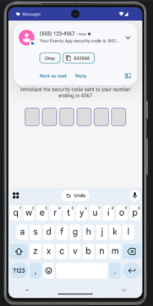
  
  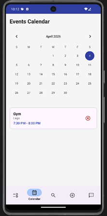
   
  <em>Figure 5 – MFA SMS, Password Recovery, and Calendar Features</em>

 

Through these enhancements, I developed a robust security mindset that anticipates vulnerabilities, evidenced by multi-factor authentication and account lockout policies. I designed and evaluated computing solutions by weighing trade-offs between local stateless sessions and state-machine architectures. Furthermore, I demonstrated the ability to use innovative techniques and tools by leveraging modern Android architecture components to build scalable features like dynamic list management. By organizing my workflow via GitHub version control and documenting architectural decisions, I effectively employed collaborative strategies and delivered professional-quality technical communication.

📄 **Read the full narrative:** [CS-499 Software Engineering Enhancement](narratives/CS-499_Software_Eng_Enhancement.pdf)

---

### Data Structures and Algorithms
I improved the application’s efficiency and usability by implementing a dedicated search feature powered by the Knuth-Morris-Pratt (KMP) pattern searching algorithm, enabling fast and flexible keyword matching. To ensure results are organized, I integrated a Merge Sort algorithm to display events chronologically, leveraging its stability and consistent $O(n \log n)$ performance. Architecturally, I isolated the search functionality into a separate screen following MVVM principles, applying an optimistic UI update strategy to keep the interface responsive.

**Key Enhancements:**
* Implementation of the KMP algorithm for precise pattern and keyword matching.
* Integration of Merge Sort to complement the search feature with stable chronological ordering.
* Transitioning from standard lists to a `LinkedHashMap` to optimize $O(1)$ lookup and deletion operations.

  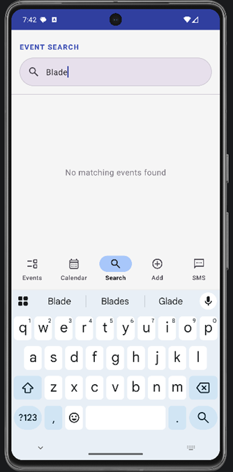
  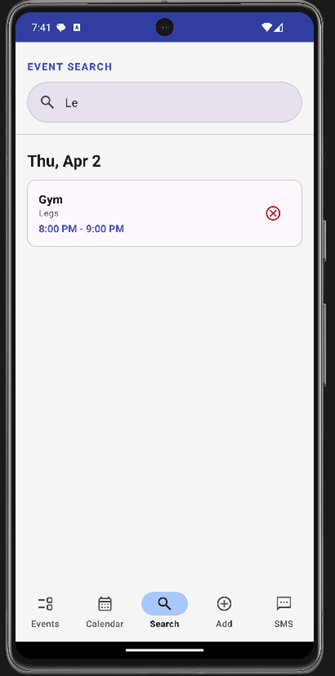
  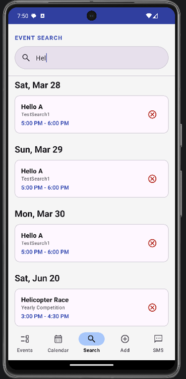
   
  <em>Figure 6 – Pattern Search Feature in Action</em>

 

By selecting the KMP algorithm, Merge Sort, and hash-based data structures, I demonstrated the ability to design and evaluate efficient computing solutions, carefully managing the trade-offs between deterministic performance, memory usage, and user experience. I utilized well-founded and innovative techniques by housing these algorithms within a strict MVVM architecture, leveraging LiveData for real-time optimistic UI updates. Furthermore, by organizing the implementation into a highly modular structure and thoroughly benchmarking Big-O complexities, I successfully employed collaborative version control strategies and generated technically sound visual and written communications to support decision-making.

📄 **Read the full narrative:** [CS-499 Data Structures & Algorithms Enhancement](narratives/CS-499_DSA_Enhancement.pdf)

---

### Databases
I transformed the application from a local-only relational model into a scalable, cloud-integrated solution. Based on a benchmark of BaaS alternatives, I engineered a hybrid architecture using Firebase Firestore as the master source of truth and Room (SQLite) as a high-performance local cache. I designed a cloud-authoritative, offline-first synchronization pattern, leveraging snapshot listeners for real-time updates. I refactored the data layer to support NoSQL document structures and UUIDs while preserving SQL schemas for local efficiency. 

**Key Enhancements:**
* Integration of a cloud-based, document-oriented database (Firestore) as the primary source of truth.
* Design of a hybrid cloud architecture enabling offline functionality with automatic background synchronization.
* Implementation of a persistent data architecture supporting consistent user sessions across multiple devices.
* Application of strict server-side security measures ensuring user-scoped data access and confidentiality.

  <figure>
    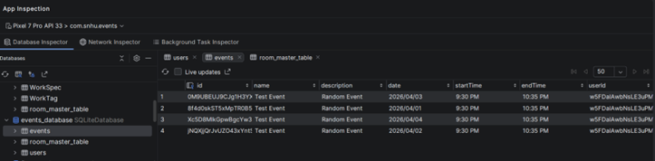
     
    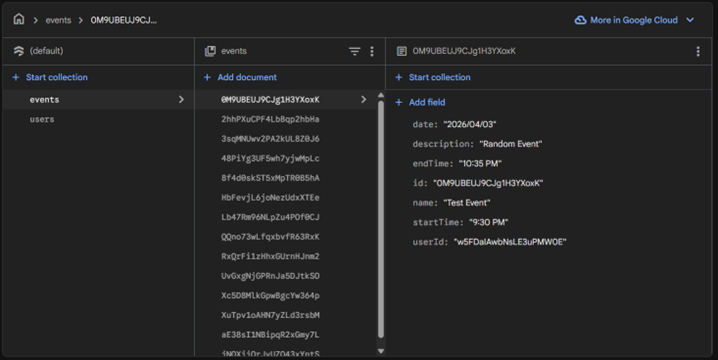
    <figcaption><em>Figure 7 – Local Room SQL Database and Firestore Cloud Non-SQL Database Integration</em></figcaption>
  </figure>

 

  <figure>
    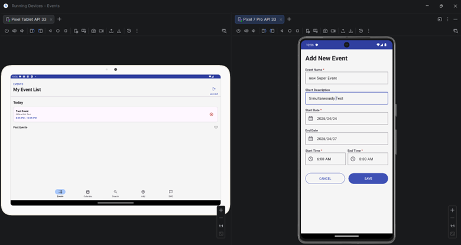
     
    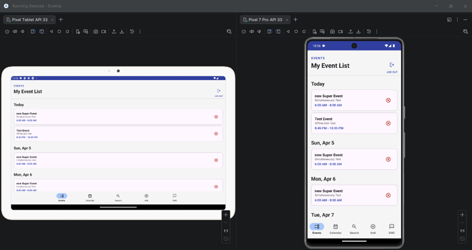
    <figcaption><em>Figure 8 – Persistent Session Synchronization across devices using hybrid cloud approach</em></figcaption>
  </figure>

 

These database enhancements seamlessly integrate the five core outcomes of the program. I anticipated adversarial exploits and ensured data privacy by implementing strict user-scoped security rules and secure authentication queries, demonstrating a mature security mindset (Outcome 5). By migrating to a hybrid Firestore/Room architecture with offline persistence and real-time snapshot listeners, I utilized highly innovative tools to deliver industry-specific value (Outcome 4). I rigorously managed the architectural trade-offs between local caching and distributed network latency to design a highly responsive solution (Outcome 3). Finally, through comprehensive documentation of my cloud benchmarking and the use of Git branching for iterative deployment, I demonstrated both professional-quality technical communication (Outcome 2) and the strategic use of collaborative environments (Outcome 1).

📄 **Read the full narrative:** [CS-499 Cloud Database Enhancement](narratives/CS-499_Cloud_DB_Enhancement.pdf)

---

## 🎯 Conclusion and Next Steps

This portfolio stands as a testament to my growth as a Computer Science professional, showcasing the ability to build robust software that balances high performance, scalable architecture, and a security-first mindset. As I look toward the future, my goal is to transition deeply into Data Science and Data Engineering roles. Because mobile devices are the primary touchpoint for modern technology, mastering multi-platform development alongside advanced data architectures ensures I can deliver data-driven, intelligent solutions directly into the hands of users effectively.

---

### 📬 Let's Connect
Feel free to reach out to discuss technology, data engineering, or potential opportunities!
📧 **Email:** [raymond.bautista@snhu.edu](mailto:raymond.bautista@snhu.edu)

> *Developed and maintained with much love by Raymond Bautista*