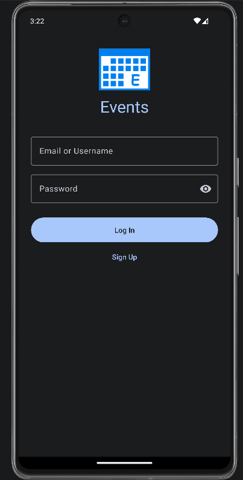
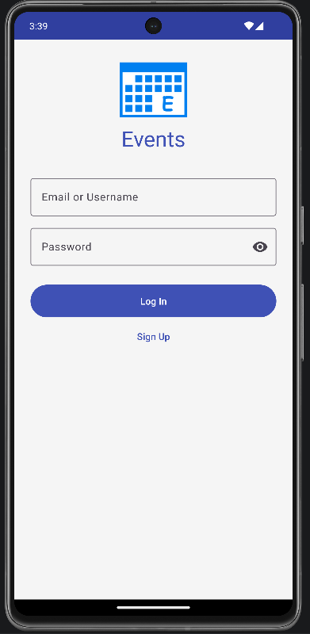
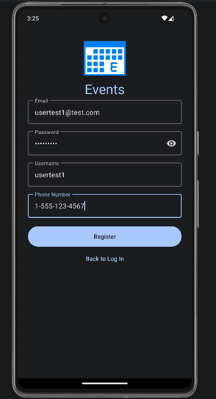
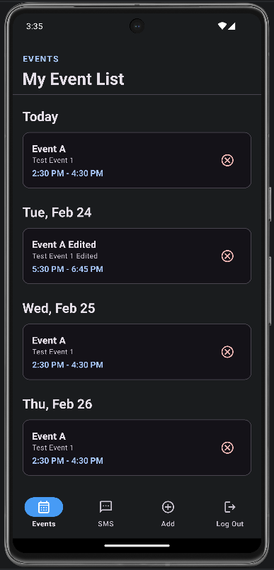
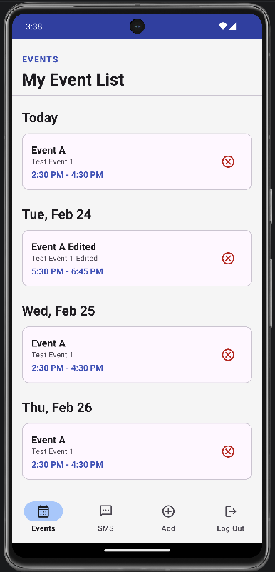
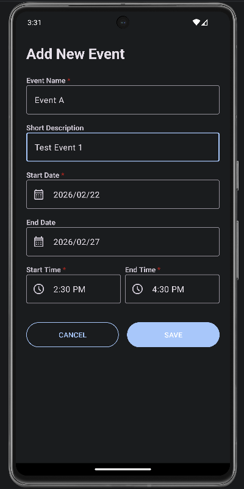
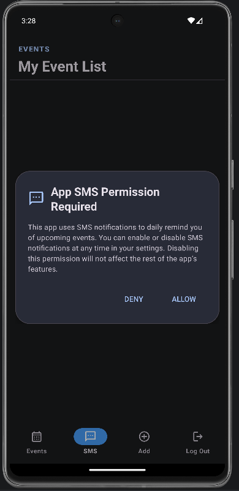

# 📱 CS-360: Mobile Architecture and Programming
## Events Mobile Application
**Raymond Bautista**

---

## 📖 Course Overview

This repository contains my work for **CS-360: Mobile Architecture and Programming** at Southern New Hampshire University.

In this course, I designed and implemented a user-centered Android application using **Android Studio, Java, and SQLite**. The project emphasized modern **UI/UX best practices**, lifecycle-aware architecture, secure authentication, and performance optimization, all while reducing user cognitive load and delivering a smooth, distraction-free experience.

---

## 🎯 Project Goal & User Needs

The **Events Mobile Application** was designed to serve as a distraction-free personal scheduling hub that empowers users to manage multi-day commitments with clarity and control.

### 👥 Target Users
- 👔 Professionals managing high-stakes deadlines
- 🏋️ Athletes maintaining structured training schedules
- 🎓 Students balancing academic milestones

Although their goals differ, they share one need:  
➡ Replace mental clutter with a structured, reliable, and secure timeline.

### ✅ Core Requirements
- Secure **Login & Sign-Up** authentication system
- Native **SQLite database** for users and events
- Create, edit, and delete event functionality
- Smart recurring event logic (start date + optional end date)
- Chronologically grouped event dashboard
- Daily **SMS notification summaries**
- Secure password storage using **Bcrypt hashing**

The application simplifies complex scheduling into an actionable daily overview while safeguarding personal data.

---

## 🖥️ Screens & Features

The UI was designed with a single guiding principle:

> Reduce cognitive load and highlight immediate priorities.

### 🎨 User-Centered Design Strategies
- Material Design color palette to emphasize action items
- Modern date and time pickers to minimize input errors
- Scrollable, chronological event grouping
- Recurring event span logic to eliminate repetitive entry
- Individual record handling for editable recurring instances
- Clear dialog confirmations for logout and SMS permissions

---

## 🔐 Login & Sign Up

  
  
  

- Shared UI components to reduce redundancy
- Secure authentication flow
- Bcrypt password hashing (no raw password storage)

---

## 📅 Main Event List

  
  

- Chronologically grouped events
- Clean, scrollable interface
- Clear display of event name, description, and time span

---

## ➕ Add & Edit Event Form

  
  

- Start and optional end date for recurrence span
- Controlled input fields to reduce user error
- Individual instance editing without affecting full recurrence

---

## 📲 Logout & SMS Dialogs

  
  
  
  

- Transparent SMS permission communication
- Daily event summary notifications
- Clear confirmation dialogs

---

## 🏗️ Architecture & Coding Approach

The application follows the **Model–View–ViewModel (MVVM)** architecture to enforce separation of concerns and lifecycle-aware state management.

### 🔹 Why MVVM?
- Preserves UI state across configuration changes
- Keeps business logic independent from UI rendering
- Improves maintainability and scalability
- Prevents unnecessary database reloads

### 🔹 Additional Technical Strategies
- 🔐 Bcrypt hashing with salting for secure authentication
- ⚡ Background threads for database and SMS operations
- 📦 WorkManager for reliable task scheduling
- ♻ Shared layouts between login and sign-up, add and edit events screens
- 🧠 Intelligent recurring event generation logic

These strategies enhance performance, stability, and extensibility for future feature expansion.

---

## 🧪 Reflection & Testing

Development followed an **incremental, iterative approach**. Each feature was implemented in isolation, tested in the Android Studio emulator, and merged only after validation.

This testing process revealed important considerations:
- Proper background task queuing for SMS scheduling
- Handling differences between system preferences and user-session data to avoid conflict
- Managing lifecycle behavior during configuration changes

One key innovation was designing the recurrence system to create independent database entries per instance. This allows users to edit or delete specific occurrences without affecting the entire event series, balancing flexibility and usability.

📄 Initial Planning & Sequence Diagram:  
> [Events Mobile App Design Planning Paper](Opt.2_Events_Project_One_Raymond_B.pdf "Events Mobile App Design Planning Paper")

---

## 🛠️ Technologies & Concepts Used

- Android Studio
- Java
- SQLite (Android Native Database)
- MVVM Architecture
- LiveData & Observers
- Material Design Guidelines
- WorkManager
- Bcrypt Hashing

---

## 🚀 Key Takeaways

This project demonstrates my ability to:

- Design secure, scalable Android applications
- Apply modern architectural patterns (MVVM)
- Implement user-centered UI/UX design
- Handle background processing efficiently
- Translate user workflows into clean, maintainable code

---

⭐ *This repository highlights my ability to build secure, user-focused mobile applications that balance performance, architecture, and usability.*