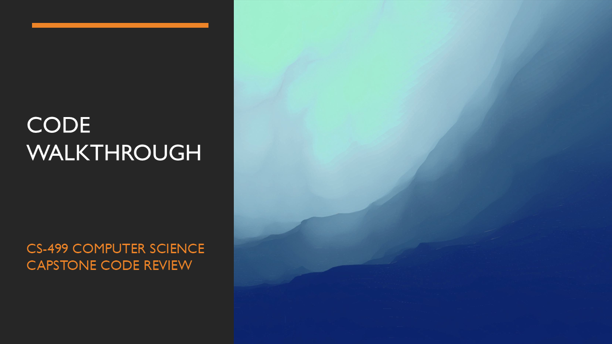

## 🔍 Technical Code Review: Events Android Application

This section presents a comprehensive **Code Review** of the "Events" Android application, originally developed for **CS-360: Mobile Architecture and Programming**. 

While typical reviews are limited to written pull requests, this video analysis provides a deep dive into the application’s core logic, functionality, and architectural integrity.

---

### 📺 Video Walkthrough

> **[Click here to view the full Code Review on Google Drive](https://drive.google.com/file/d/10koSWxyQLtFEhYQfeObbxoFAz5xMFhHr/view?usp=drive_link)**
> *Note: The video covers initial app limitations, code analysis, and the roadmap for the upcoming enhancements.*

---

### 🛠️ Analysis & Architectural Insights

The review evaluates the software from both a **developer** and **end-user** perspective, bridging the gap between technical implementation and user experience. 

#### **Key Enhancement Opportunities Identified:**

* **✨ User Experience (UX):**
    * Integration of a dynamic **Calendar View** for better event tracking.
    * Implementation of a robust **Search Functionality** to improve data accessibility.

* **🔐 Security & Performance:**
    * Transitioning to **Multifactor Authentication (MFA)** for heightened user security.
    * Adopting **Stateless Session Management** to improve scalability.
    * Optimizing **Data Structures** to ensure efficient memory usage and faster processing.

---

### 📋 Review Structure
The walkthrough is divided into three strategic segments:

1.  **Project Overview:** A demonstration of current features and UI/UX within the Android Studio IDE.
2.  **Code Walkthrough:** A deep dive into the software architecture, design patterns, and engineering decisions.
3.  **Compliance Audit:** A final evaluation against industry-standard checklists for documentation, structure, and security.
