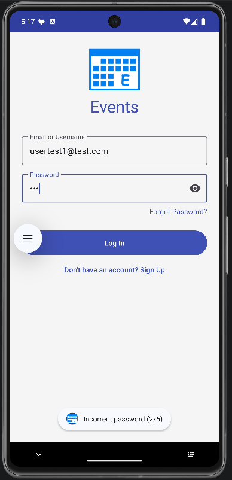
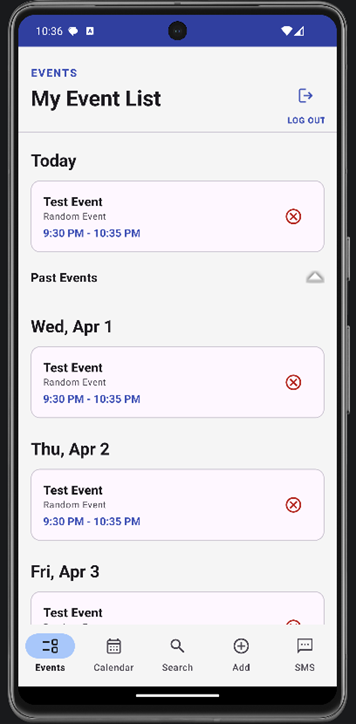
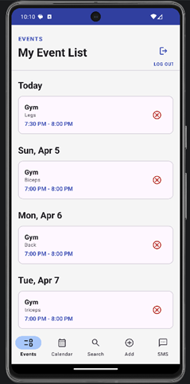
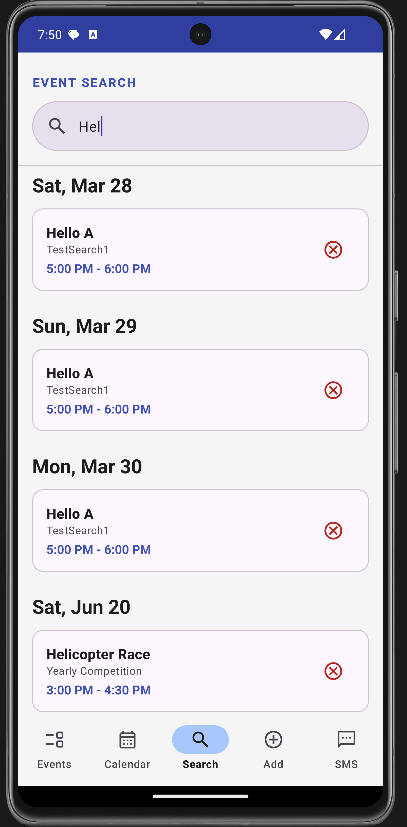
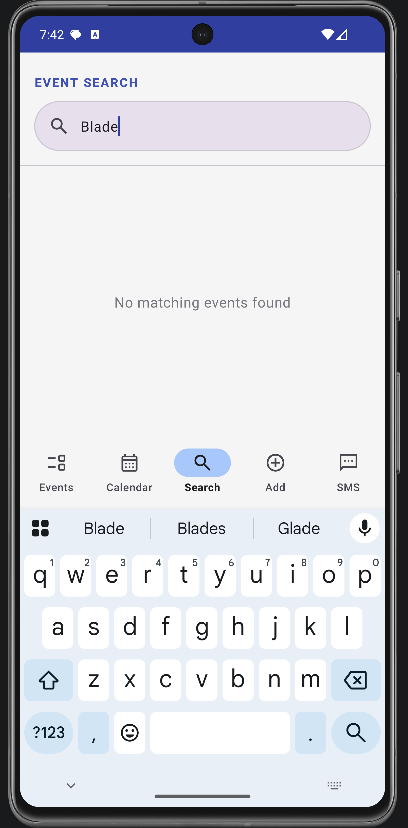
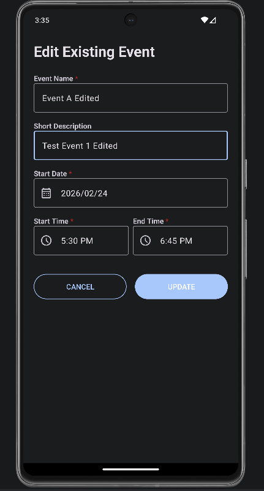
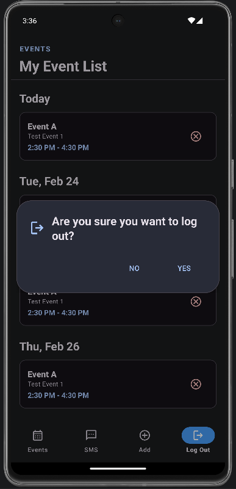
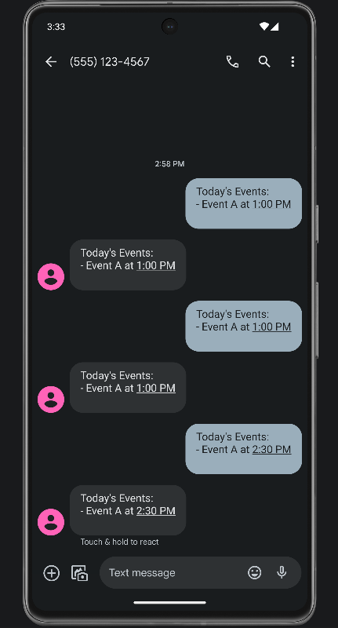
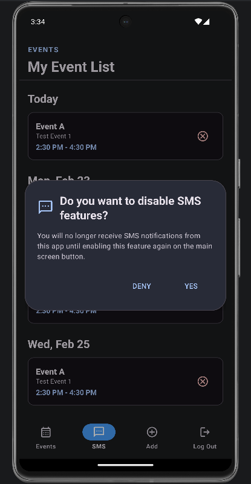

# 📱 CS-360: Mobile Architecture and Programming
## Events Mobile Application
**Raymond Bautista**

*Last Updated on April 19, 2026*

---

## 📖 Course Overview

This repository documents the evolution of the Events Android Application, which originated in **CS-360: Mobile Architecture and Programming** as a foundational project focused on **Java, SQLite, and user-centered UI/UX design**. Within the **CS-499: Computer Science Capstone**, I transformed this application into a professional-grade solution by implementing rigorous enhancements across three technical pillars. I moved beyond local persistence to a **cloud-integrated hybrid architecture (Firestore/Room)**, optimized performance through **advanced data structures and KMP search algorithms**, and significantly hardened the security posture with **Multi-Factor Authentication (MFA) and stateless session management**. This progression demonstrates a comprehensive mastery of scalable mobile architecture, security-first design, and the ability to refactor legacy code into a modern, distributed system.

---

## 🎯 Project Goal & User Needs

The **Events Mobile Application** was designed to serve as a distraction-free personal scheduling hub that empowers users to manage multi-day commitments with clarity and control.

### 👥 Target Users
- 👔 Professionals managing high-stakes deadlines
- 🏋️ Athletes maintaining structured training schedules
- 🎓 Students balancing academic milestones

Although their goals differ, they share one need:  
➡ Replace mental clutter with a structured, reliable, and secure timeline.

### ✅ Core Requirements & Advanced Enhancements

The **Events App** has been transformed from a local utility into a secure, distributed system. Below are the core features and the specific technical enhancements implemented during the Capstone term.

#### 🛡️ Software Design & Engineering (Security & UX)
* **Hardened Authentication:** Implemented **Multi-Factor Authentication (MFA)** via SMS for login and password recovery, alongside brute-force mitigation using login attempt limiting and cooldown periods.
* **State-Machine Architecture:** Redesigned the authentication lifecycle using a state-machine approach and implemented **stateless session management** for persistent, secure user sessions.
* **Enhanced UI/UX:** Introduced an integrated **Calendar View** and optimized the dashboard by grouping past events into collapsible sections to reduce cognitive load.
* **Modern Design Patterns:** Re-architected the application using **MVVM (Model-View-ViewModel)** principles to ensure separation of concerns and reusability.

#### 🧮 Data Structures & Algorithms (Efficiency)
* **Pattern-Based Search:** Integrated the **Knuth-Morris-Pratt (KMP) algorithm** to provide fast, flexible keyword matching across event titles and descriptions.
* **Chronological Optimization:** Implemented **Merge Sort** to ensure stable, $O(n \log n)$ performance when organizing event timelines.
* **Data Structure Refinement:** Transitioned to **LinkedHashMap** to optimize lookup and deletion operations while maintaining insertion order.
* **Optimistic UI Updates:** Applied asynchronous update strategies to ensure the interface remains responsive during data processing.

#### ☁️ Database & Cloud Infrastructure (Scalability)
* **Hybrid Cloud Architecture:** Migrated to a dual-layer system using **Firebase Firestore** as the master source of truth and **Room (SQLite)** as a high-performance local cache.
* **Offline-First Synchronization:** Developed a cloud-authoritative sync pattern that allows authenticated users to manage events offline with automatic background reconciliation.
* **NoSQL Migration:** Re-engineered the data layer to support **NoSQL document structures**, including a migration to globally unique string identifiers (UUIDs).
* **User-Scoped Security:** Implemented server-side security rules to ensure strict data isolation, ensuring users can only access and modify their own event data.

> The application successfully balances high-performance local responsiveness with the scalability of a cloud-native environment, meeting modern standards for mobile security and efficiency.

---

## 🖥️ Screens & Features

The UI was designed with a single guiding principle:

> Reduce cognitive load and highlight immediate priorities.

### 🎨 User-Centered Design Strategies
- **Material Design** color palette to emphasize action items.
- **Modern date and time pickers** to minimize input errors.
- **Visual search and filtering** to provide instant access to data.
- **Chronological navigation** via both list and calendar views.
- **Clear dialog confirmations** for logout and security permissions.

---

## 🔐 Login & Sign Up

  
  
  
  

- **Multi-Factor Authentication (MFA):** Secure SMS-based identity verification for both login and password recovery.
- **Brute-Force Protection:** Intelligent login attempt limiting with mandatory cooldown periods after consecutive failures.
- **MFA Password Recovery:** Identity-confirmed password reset workflows to prevent unauthorized account takeover.
- **Secure Storage:** Implementation of **Bcrypt password hashing** to ensure no raw credentials ever touch the database.

---

## 📅 Main Event List & Calendar

  
  
  

- **Dynamic Priority Grouping:** Current and upcoming events are prioritized, while past events are grouped into a collapsible section to reduce clutter.
- **Integrated Calendar View:** A visual alternative to the agenda list, allowing users to navigate and select events by date intuitively.
- **Real-Time Sync:** Features an offline-first approach that synchronizes local changes with the cloud instantly upon reconnection.

---

## 🔍 Advanced Search Functionality

  
  

- **Pattern Matching (KMP):** High-performance keyword search utilizing the **Knuth-Morris-Pratt algorithm** for efficient string matching.
- **Optimized Sorting:** Integrated **Merge Sort** to ensure search results are always displayed in a stable, chronological order.
- **Optimistic UI Updates:** The interface reflects changes immediately while background processes finalize data handling, ensuring a lag-free experience.

---

## ➕ Add & Edit Event Form

  
  

- **Recurrence Logic:** Start and optional end dates for flexible event spans.
- **Controlled Inputs:** Validation-aware fields to eliminate data entry errors.
- **Granular Editing:** Ability to modify individual event instances without disrupting the entire recurring series.

---

## 📲 Logout & SMS Dialogs

  
  
  
  

- **Transparent Permissions:** Clear communication regarding why and how SMS permissions are utilized.
- **Automated Summaries:** Daily notification system providing users with a snapshot of their scheduled tasks.
- **Secure Session Termination:** Explicit logout confirmations that clear stateless session tokens.

---

## 🏗️ Architecture & Coding Approach

The application follows the **Model–View–ViewModel (MVVM)** architecture to enforce strict separation of concerns and lifecycle-aware state management.

### 🔹 Advanced Technical Implementations

* **Synchronized Hybrid Cloud Approach:** Implemented a dual-layer data strategy utilizing **Firebase Firestore** as the master source of truth and **Room (SQLite)** as a high-performance local cache. This ensures the app remains fully functional offline while providing real-time data synchronization across multiple devices for authenticated users.
* **Optimistic UI Updates:** To ensure a fluid user experience, the Search and Event management features utilize an optimistic update strategy. The UI reflects changes immediately, while the repository layer handles background synchronization with the cloud, effectively hiding network latency.
* **Hardened Security Architecture:** Security is managed through a multi-layered approach: **Bcrypt hashing** for data at rest, **SMS-based Multi-Factor Authentication (MFA)** for identity verification, and a **State-Machine** logic to manage stateless, persistent user sessions.
* **High-Performance Search (KMP Algorithm):** The search feature leverages the **Knuth-Morris-Pratt (KMP)** algorithm for string matching. By pre-processing the pattern, search operations maintain high efficiency even as the event database scales, avoiding the performance pitfalls of standard linear searches.

### 🔹 Core Design Principles
- **Separation of Concerns:** ViewModels handle all business logic, keeping Activity/Fragment code focused strictly on UI rendering.
- **Scalability:** The transition from local lists to a **LinkedHashMap** data structure ensures $O(1)$ lookups and efficient deletion as the user's event history grows.
- **Resource Management:** Utilizes **WorkManager** and background threads to ensure heavy cryptographic and network operations never block the main UI thread.

---

## 🧪 Reflection & Testing

Development followed an **incremental, iterative approach**, evolving from a local utility into a secure distributed system. Each enhancement was validated through a combination of manual testing in the Android Studio emulator and structural code reviews.

### 📄 Documentation & Narrative Deep-Dives
For a detailed look at the research, trade-offs, and implementation logs for each phase of this project, please refer to the following narratives located in the root directory:

* [**Strategic Enhancement Plan**](../narratives/CS%20499_Module_One_Enhancement_Plan.pdf) – Project audit and roadmap definition.
* [**Software Design & Engineering**](../narratives/CS-499_Software_Eng_Enhancement.pdf) – Deep dive into MFA, security protocols, and UX refactoring.
* [**Data Structures & Algorithms**](../narratives/CS-499_DSA_Enhancement.pdf) – Analysis of KMP, Merge Sort, and Big-O complexity.
* [**Database & Cloud Integration**](../narratives/CS-499_Cloud_DB_Enhancement.pdf) – Cloud benchmarking and hybrid architecture implementation.

---

## 🛠️ Technologies & Concepts Used

- **Languages & IDE:** Java | Android Studio
- **Architecture:** MVVM | Repository Pattern | State-Machine Authentication
- **Database:** Firebase Firestore (NoSQL) | Room (SQLite)
- **Algorithms:** Knuth-Morris-Pratt (Search) | Merge Sort (Sorting)
- **Security:** Bcrypt Hashing | SMS MFA | Stateless Session Management
- **UI/UX:** Material Design | Calendar View | Optimistic UI Updates
- **Async Processing:** LiveData | Observers | WorkManager

---

## 🚀 Key Takeaways

This project demonstrates my ability to:
- **Design secure, scalable Android applications** that bridge the gap between local performance and cloud scalability.
- **Apply advanced computer science principles**, including algorithmic optimization and complex data structure management.
- **Refactor legacy code** into a modern, distributed system while maintaining architectural integrity.
- **Synthesize user requirements** into a professional-grade product that prioritizes both security and usability.

---

⭐ *This repository stands as a testament to my growth as a Computer Science professional, showcasing the ability to build robust software that balances performance, architecture, and a security-first mindset.*
